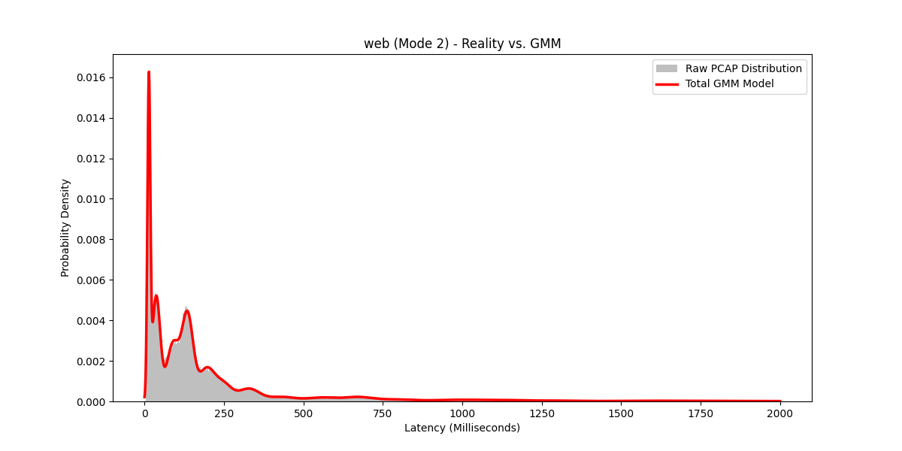
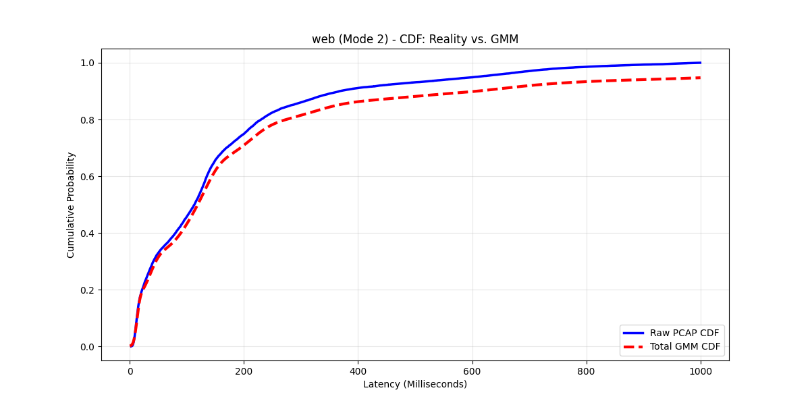
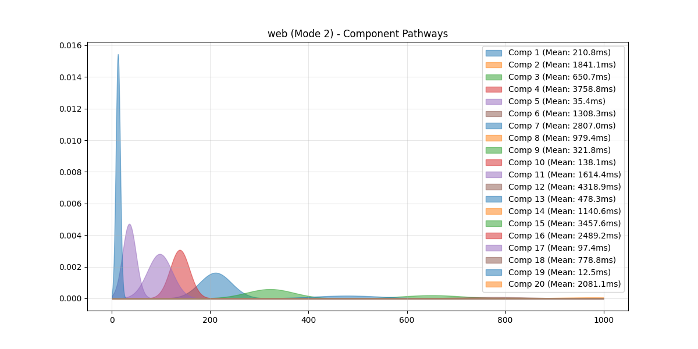

# IRCTC-Simulator
IRCTC-Simulator emulates a layered IRCTC-style request path in Mininet, injects realistic per-hop delay distributions, captures traffic, and then runs offline PCAP analysis pipelines.
## What I Learned (Engineering Decisions)
Building this simulator involved several interesting engineering choices to ensure the synthetic traffic mirrored reality as closely as possible:
- **Modeling Reality with Gaussian Mixture Models (GMMs):** Real network latency isn't just a static sleep() command or a simple bell curve. Traffic experiences multimodal latency distributions (e.g., a fast path for cached responses vs. a slower path for database queries). By fitting GMMs to real-world PCAP data, the simulator injects delays that perfectly mimic authentic jitter and latency spikes, rather than relying on uniform artificial delays.
- **Asynchronous Traffic Generation:** Pushing high-volume simulated traffic through Mininet initially created bottlenecks. I pivoted to using aiohttp combined with uvloop for the load generator (user1). Synchronous requests would block the simulation, but async I/O allowed the generation of realistic, highly concurrent HTTPS load patterns without the client artificially capping the network throughput.
- **The Compounding Cost of Layered Proxies:** Splitting the architecture into distinct zones (Edge $\rightarrow$ DMZ $\rightarrow$ App) and chaining proxies per node revealed exactly how TCP and TLS handshakes compound latency at every single hop. This layered emulation captures the "hidden" network taxes that flat-network simulations completely miss.
## Delay Modeling & Comparisons
To ensure our emulated delays accurately reflect real-world network behavior, the pipeline extracts latency metrics from PCAPs, fits them to GMMs, and compares the simulated outputs back against the ground truth.
Below are the visualization outputs from the Web Server (web) node comparing the simulated distributions against the actual mathematical models: 

- **Probability Distribution Function (PDF)**
This shows the raw probability density of the delays. Notice how the multimodal nature of the network traffic is captured.

This image shows the pdf calculated from raw PCAP vs Calculated using GMM
- **Cumulative Distribution Function (CDF)**
The CDF provides a clear view of the latency percentiles, proving that the long-tail latencies in our simulated environment align with the theoretical models.
This image shows the cdf calculated from raw PCAP vs Calculated using GMM

- **GMM Components**
Because network requests fall into different "buckets" of latency (cache hit, processing delay, deep inspection), the GMM is broken down into its underlying Gaussian components.
This image shows individual components of the GMM which together create the underlying model of the network component
  

If you are new to the project, start here, then read:
- [Architecture](docs/ARCHITECTURE.md)
- [File Guide](docs/FILE_GUIDE.md)
- [Workflows](docs/WORKFLOWS.md)

---
## 1) What this project is trying to do
This repository answers two questions:
1. **How does traffic behave across a segmented network path** (edge → DMZ → management/app)?
2. **How do those behaviors show up in packet captures** (HTTP/TLS RTT, sockets, ASN ownership)?

To do that, it has two major parts:
- `Mininet/` → runtime simulation and traffic generation
- `PCAP/` → offline analysis and reporting from PCAP files

---
## 2) How the system works at a glance
1. Build Mininet topology (`user1 -> r1 -> ips -> fw1 -> adc1 -> waf1 -> web -> fw2 -> slb1 -> app`)
2. Start per-node proxy services that forward traffic hop-by-hop
3. Apply delay sampling (`delays_seconds`) per hop from JSON profiles
4. Generate HTTPS load from `user1` to ADC (`https://10.0.3.1/`)
5. Capture packet traces on selected nodes into `Mininet/PCAP/*.pcap`
6. Run protocol analyzers under `PCAP/` for reports/plots/CSV outputs

Main runtime entrypoint: `Mininet/emulation.py`

---
## 3) Repository map for new contributors
### Runtime/emulation
- `Mininet/emulation.py` — main orchestrator
- `Mininet/Servers/*.py` — node behaviors (IPS/ADC/WAF/Web/FW2/SLB/App)
- `Mininet/traffic_gen.py` — HTTPS load generator
- `Mininet/topology.py` — older interactive/manual topology runner

### Delay-model pipeline
- `PCAP/Code/full_gmm.py` — fit latency GMM models from PCAP
- `PCAP/Code/generate_mininet_delays.py` — generate delay sample JSON for proxies
- `PCAP/Code/run_analysis.sh` — batch helper for standard scenario PCAPs

### Analysis pipelines
- `PCAP/http/` — request extraction, GET/POST grouping, HTTP RTT
- `PCAP/tls/` — TLS extraction and RTT distribution
- `PCAP/Sockets/` — unique IP/socket/biflow and protocol summaries
- `PCAP/ASN/` — public-IP ASN enrichment 

---
## 4) Prerequisites

There is no single dependency lock file in repo. You need:
- Linux host with `sudo`
- Mininet + OVS
- `tcpdump`, `ethtool`, `iptables`, `tshark`
- Python 3 packages used across scripts (commonly: `aiohttp`, `uvloop`, `dpkt`, `numpy`, `pandas`, `matplotlib`, `scikit-learn`, `joblib`, `pytricia`, `maxminddb`, `tqdm`)

Also ensure ADC cert/key exist:
- `Mininet/Servers/SSL_Keys/adc_cert.pem`
- `Mininet/Servers/SSL_Keys/adc_key.pem`

---
## 5) Quick start (end-to-end)

### Step A: Generate/prepare per-node delay profiles
Expected by server scripts under:
- `Mininet/Servers/mininet_delays/*.json`
Format:

```json

{"delays_seconds": [0.0012, 0.0021, ...]}

```

You can create these with the GMM pipeline in `PCAP/Code/`.
### Step B: Run emulation

```bash
cd Mininet
sudo python3 emulation.py
```
Inside Mininet CLI, validate if needed, then `exit` to teardown.
### Step C: Analyze generated or provided PCAPs
- HTTP RTT batch: `cd PCAP/http/RTT && bash run.sh`
- TLS RTT batch: `cd PCAP/tls && bash run.sh`
- Socket protocol summaries: `cd PCAP/Sockets/Port && bash run.sh`
- ASN mapping: `cd PCAP/ASN && python3 ASN.py -i <ip_file> -m <GeoLite2-ASN.mmdb> -o <output_folder>`
---
## 6) Important operational notes
- `Mininet/emulation.py` currently includes **machine-specific absolute paths** for Python and server script directory; adjust these first on a new environment.
- Batch scripts in `PCAP/**/run.sh` assume input captures under `Data/Input_PCAP/` with scenario names (`3`, `5`, `6-7`, `8-9`, `10`, `11`, `12`).
- `PCAP/tls/run.sh` uses a subnet-specific TLS display filter tuned to known IRCTC-like ranges.
- `traffic_gen.py` disables certificate verification to allow self-signed ADC certs.
---
## 7) What “success” looks like after a run
- Emulation produces node PCAPs in `Mininet/PCAP/`
- Logs appear under `Mininet/Logs/` (unless logging is disabled)
- HTTP/TLS scripts generate CSV + PNG outputs in per-scenario folders
- Sockets/ASN scripts generate markdown/CSV/Excel summaries for reporting
---
## 8) Legacy/experimental areas
- `PCAP/http/old/` and some `PCAP/http/HTTP packets uri/` content are historical
- `PCAP/tls/Old/` contains prior outputs/approaches
- `Mininet/topology.py` is useful for manual debugging, but `Mininet/emulation.py` is the primary automated path