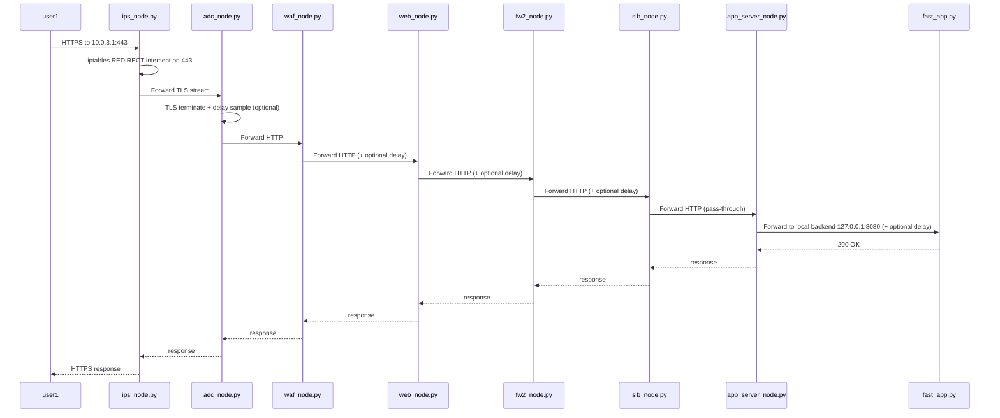
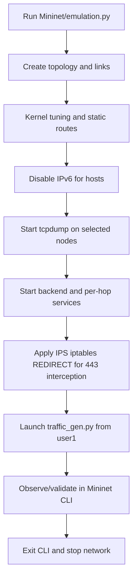
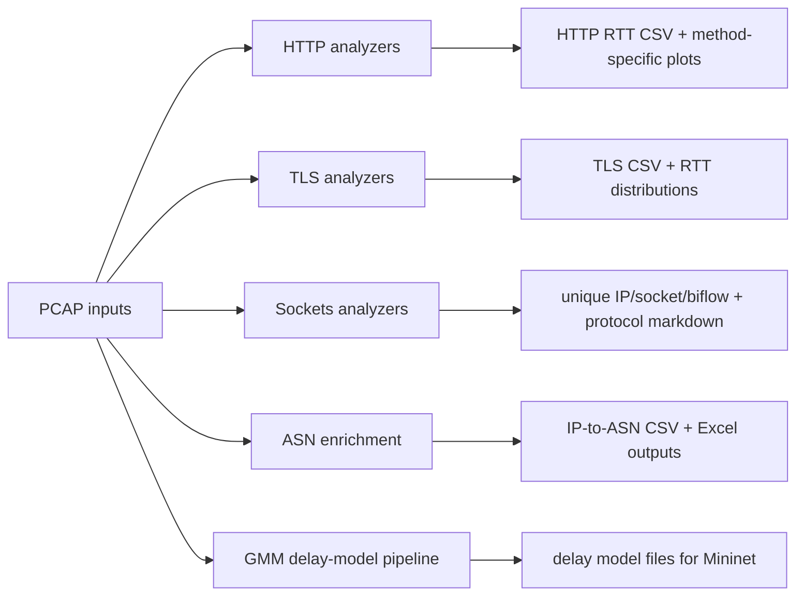

# Architecture and Structural Diagrams

## 1) System intent

The simulator models a segmented ingress path and makes latency behavior explicit at each hop.

Why this exists:

- Separate **network zones** (edge, DMZ, management/app) for realistic pathing.
- Inject **per-hop delay distributions** from empirical/modelled data.
- Keep runtime and analysis decoupled, so PCAPs can be re-analyzed without rerunning Mininet.

---

## 2) Runtime topology (as implemented)

Reference: `Mininet/emulation.py` (`CRISDCNetwork.build` and `run`)

```mermaid
graph LR
  U[user1\n10.0.0.1/24]
  S1[s1]
  R[r1\n10.0.0.254 + 10.0.1.254]
  IPS[ips\n10.0.1.253 + 10.0.2.254]
  FW1[fw1\n10.0.2.253 + 10.0.3.254]
  S2[s2]
  ADC[adc1\n10.0.3.1]
  WAF[waf1\n10.0.3.2]
  WEB[web\n10.0.3.3]
  FW2[fw2\n10.0.3.253 + 10.0.4.254]
  S3[s3]
  SLB[slb1\n10.0.4.1]
  APP[app\n10.0.4.2]

  U --> S1 --> R --> IPS --> FW1 --> S2
  S2 --> ADC --> WAF --> WEB --> FW2 --> S3 --> SLB --> APP
```

---

## 3) Request/response path behavior

### TLS ingress path

### Delay model usage

- Most nodes sample random values from `mininet_delays/*_delays.json` (`delays_seconds` array).
- SLB is intentionally pass-through (no added delay).
- `NO_DELAY_MODE=1` disables delay injection in node services.

---

## 4) Runtime orchestration pipeline

Captured nodes by default: `user1`, `ips`, `adc1`, `app`, `waf1`, `web`, `fw2`  
Capture filter: `tcp port 80 or tcp port 443`

---

## 5) Offline analysis architecture

---

## 6) Design decisions and tradeoffs

- **Chained application proxies** make hop-by-hop effects measurable and debuggable.
- **Generated delay pools** are simple to sample at runtime and avoid expensive per-request model inference.
- **Standalone analysis scripts** make ad-hoc forensic runs easy, but dependency management is manual.
- **Scenario IDs** (`3`, `5`, `6-7`, `8-9`, `10`, `11`, `12`) support comparative experiments but rely on naming conventions in shell scripts.
