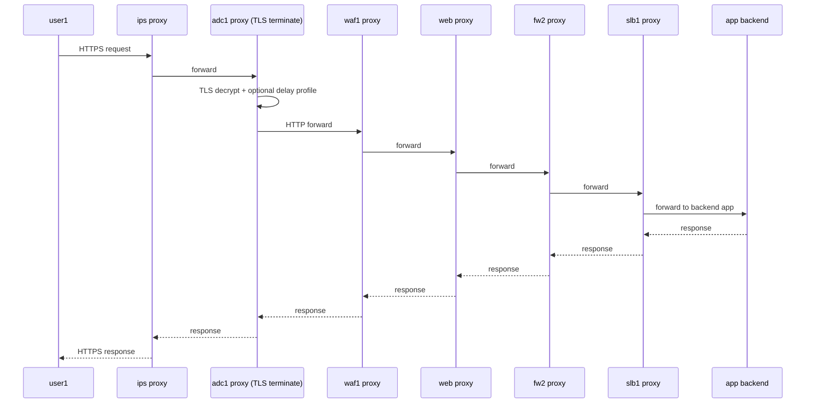
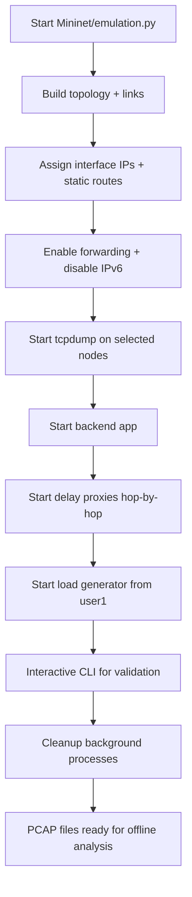
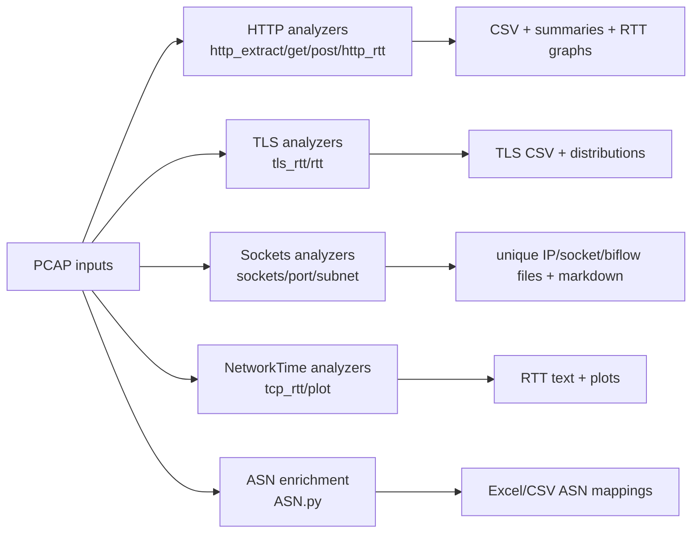

# Architecture and Structural Diagrams

## 1) System Context

The simulator models a layered ingress path similar to production network segmentation:

- External user traffic enters through edge/border controls.
- Traffic traverses DMZ controls (ADC/WAF/Web layer).
- Requests are forwarded to management/application tier.
- Delay profiles are injected per hop to emulate realistic latency behavior.

## 2) Topology Structure (Mininet)

```mermaid
graph LR
  U[user1\n10.0.0.1/24]
  S1[s1 / ISP switch]
  R[r1\n10.0.0.254 + 10.0.1.254]
  IPS[ips\n10.0.1.253 + 10.0.2.254]
  FW1[fw1\n10.0.2.253 + 10.0.3.254]
  S2[s2 / DMZ switch]
  ADC[adc1\n10.0.3.1]
  WAF[waf1\n10.0.3.2]
  WEB[web\n10.0.3.3]
  FW2[fw2\n10.0.3.253 + 10.0.4.254]
  S3[s3 / MZ switch]
  SLB[slb1\n10.0.4.1]
  APP[app\n10.0.4.2]

  U --> S1 --> R --> IPS --> FW1 --> S2
  S2 --> ADC --> WAF --> WEB --> FW2 --> S3 --> SLB --> APP
```

Reference implementation: `Mininet/emulation.py` (`CRISDCNetwork.build`).

## 3) Request Path Sequence (TLS edge)

## 4) Runtime Pipeline (emulation side)

## 5) Offline Analysis Pipeline (PCAP side)

## 6) Why this structure exists

- **Layered path**: separates edge, DMZ, and app zones for realistic security/perimeter behavior.
- **Delay profiles per hop**: allows replaying empirical latency distributions rather than fixed sleeps.
- **Standalone analyzers**: each script focuses on one protocol outcome, making post-capture analysis composable.
- **Generated outputs versioned by scenario IDs** (e.g., `3`, `5`, `6-7`, `8-9`, etc.): supports comparative experiments.
