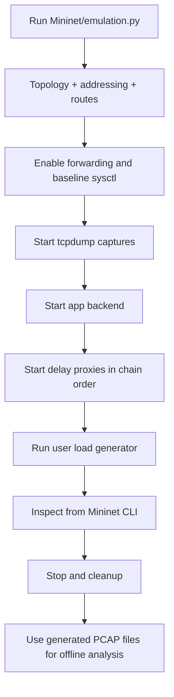
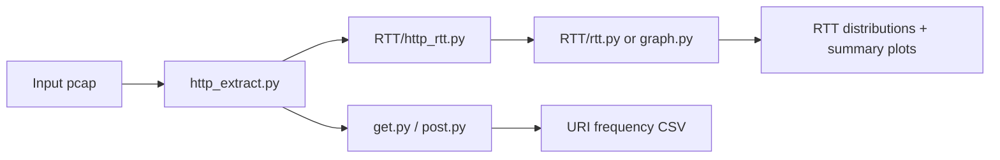
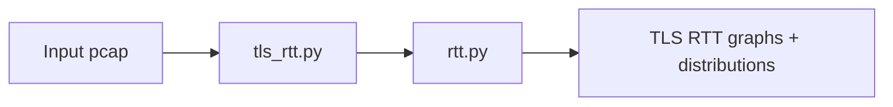
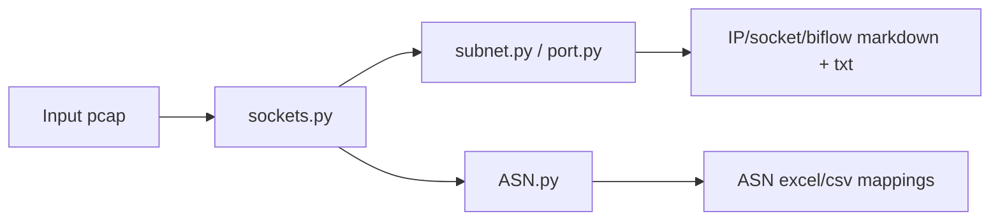

# Execution and Analysis Workflows

## 1) End-to-End Emulation Workflow

### Practical behavior

- `emulation.py` hard-codes a startup order because each hop depends on next-hop availability.
- Delay profile files under `Mininet_Profiles/` are consumed by `delay_proxy.py`.
- TLS is terminated at ADC edge (configured with cert/key), then forwarded internally.

## 2) HTTP Analysis Workflow

## 3) TLS Analysis Workflow

## 4) Socket + ASN Workflow

## 5) File/Folder Intent at a Glance

- **Runtime code**: `Mininet/`
- **Runtime services**: `Mininet/Servers/`
- **Captured artifacts**: `PCAP/...` scenario folders
- **Offline analyzers**: `PCAP/*/*.py`

## 6) Why these workflows are separated

- Emulation and analysis have different compute/runtime dependencies.
- Analysts can rerun parsing scripts on existing PCAPs without rerunning Mininet.
- Per-protocol scripts keep outputs modular and easier to validate.
