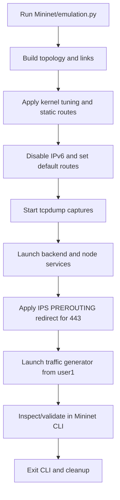
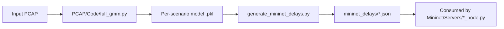
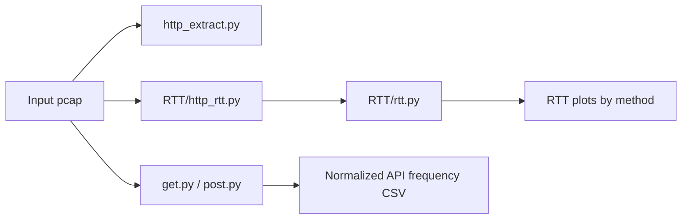
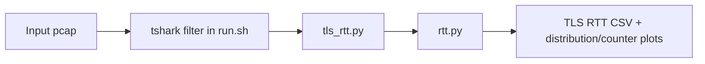
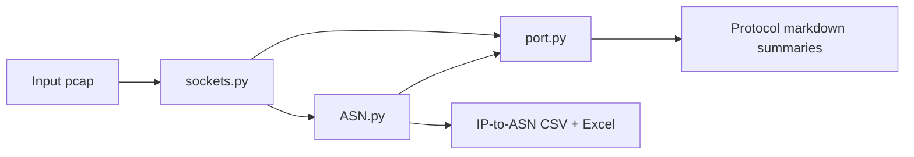

# Execution and Analysis Workflows

This document is the practical “what to run, in what order, and why.”

---

## 1) End-to-end emulation workflow



### What you need before running

- Mininet + OVS + Linux networking tools (`tcpdump`, `iptables`, `ethtool`)
- Python environment with runtime packages used by node services
- ADC TLS cert/key in `Mininet/Servers/SSL_Keys/`
- Delay pool JSON files under `Mininet/Servers/mininet_delays/`

### Run

```bash
cd Mininet
sudo python3 emulation.py
```

Generated captures are written to `Mininet/PCAP/`.

---

## 2) Delay model generation workflow (for Mininet delay pools)



Batch helper for standard scenarios:

```bash
cd PCAP/Code
bash run_analysis.sh
```

---

## 3) HTTP analysis workflow



Batch RTT path used in repo:

```bash
cd PCAP/http/RTT
bash run.sh
```

Default script assumes `Data/Input_PCAP/{8-9,10,11,12}.pcap`.

---

## 4) TLS analysis workflow



Batch run:

```bash
cd PCAP/tls
bash run.sh
```

Notes:

- `run.sh` filters traffic with a subnet-specific TLS filter expression.
- Scenario defaults are `3`, `5`, and `6-7`.

---

## 5) Sockets + ASN workflow



Typical sequence:

1. Generate unique IP/socket/biflow lists with `sockets.py`
2. Build ASN map with `ASN.py`
3. Generate per-protocol markdown summaries with `port.py` (or `Port/run.sh`)

---

## 6) Operational caveats to know

- `Mininet/emulation.py` contains absolute machine-specific paths for Python/script dir; update these on new setups.
- Batch scripts rely on scenario-named inputs in `Data/Input_PCAP/`.
- Some analysis choices are intentionally environment-specific (for example TLS subnet filter in `PCAP/tls/run.sh`).
- Runtime captures only include TCP 80/443 by default.

---

## 7) Why workflows are split

- Emulation requires privileged networking/runtime dependencies.
- Analysis can run independently on existing PCAP archives.
- Protocol-specific scripts keep outputs small, targeted, and easier to validate.
